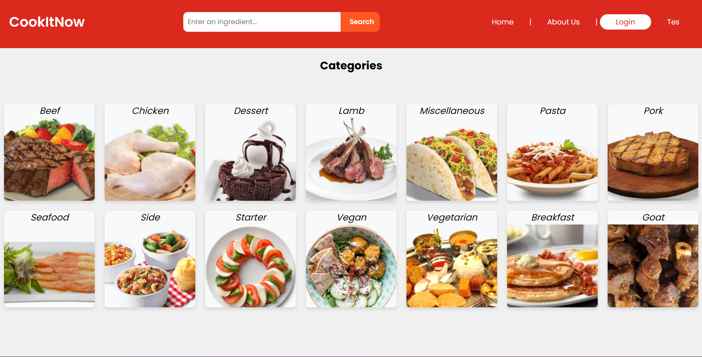
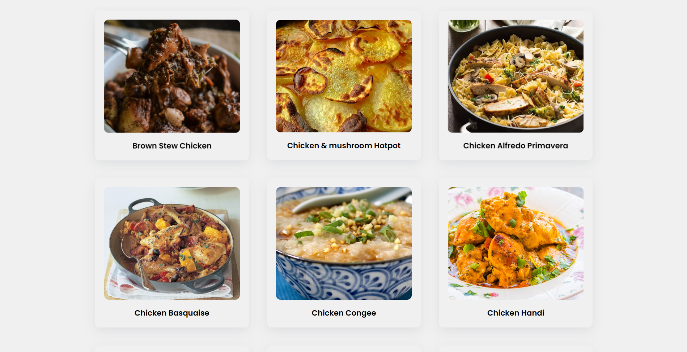
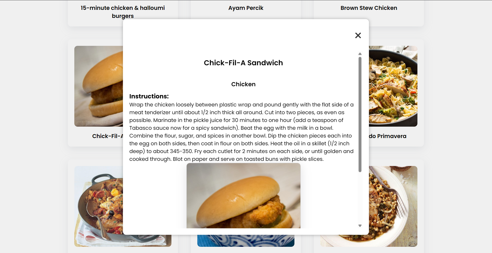
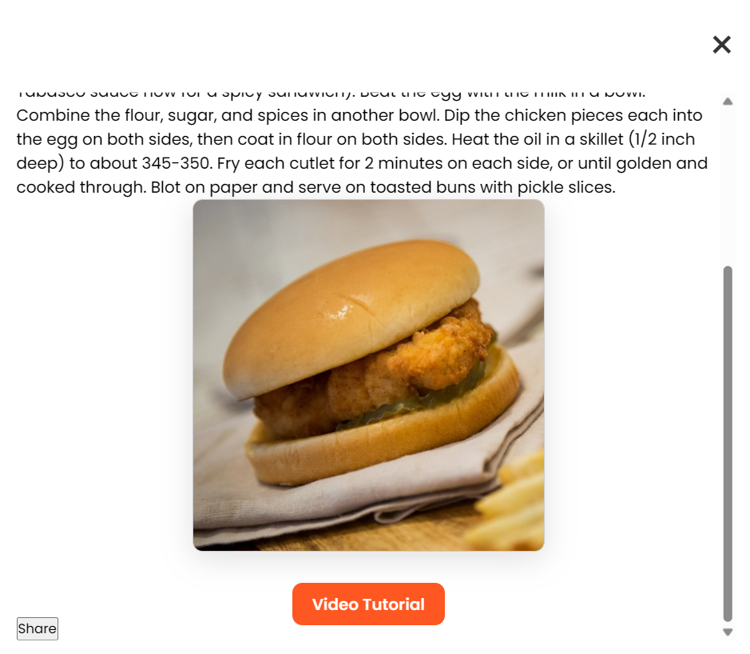

# 🍽️ Recipe Finder Web App (Laravel + TheMealDB API)

A recipe browsing website built using **Laravel**, consuming data from **TheMealDB API**.  
Users can explore recipes from different categories, search meals, and view detailed cooking instructions.

I worked on the **frontend and API integration**, while my teammate handled parts of backend structure.

---

## 🎯 Features

✅ Browse recipes from TheMealDB API  
✅ Search meals by name & category  
✅ Detailed recipe information page (image, ingredients, steps)  
✅ Responsive UI built with Bootstrap  
✅ Dynamic Blade templates  
✅ Real-time API data fetching  

---

## 🔗 API Used

**TheMealDB API**  
https://www.themealdb.com/api.php  

Used to fetch:

- Recipe List
- Categories
- Thumbnail images
- Ingredients
- Instructions

---

## 🧠 Tech Stack

| Category | Tools |
|---|---|
Frontend | HTML, CSS, Bootstrap, JavaScript, Blade  
Backend | Laravel + API consumption  
API | TheMealDB REST API  

---

## 👨‍💻 My Role (Frontend & API Integration)

- Designed responsive UI layouts using Bootstrap  
- Built Blade templates for recipe pages  
- Integrated TheMealDB API using Laravel controllers & HTTP requests  
- Handled dynamic search UI & displaying recipe results  
- Ensured clean component-based UI  

---

## 📸 Screenshots

  

  

  

  

---

## 🤝 Team Collaboration

| Role | Contributor |
|---|---|
Frontend + API Integration | **Faith Greatfull Samuel Taressy**  
Backend Support | Teammate  

---

## 📬 Contact

**Faith Greatfull Samuel Taressy**  
📧 faithtaressy043@gmail.com  
🔗 LinkedIn: https://www.linkedin.com/in/faithtaressy
